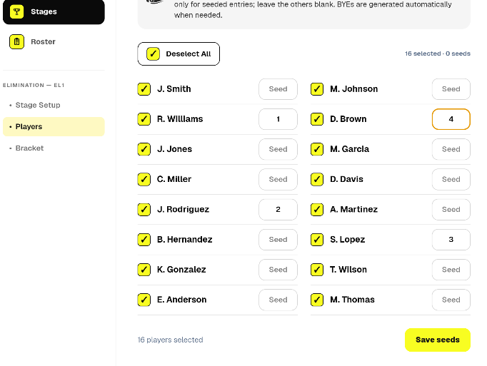

# Pickleball Arena Tournament Manager

## Elimination

**Product:** Pickleball Arena Tournament Manager\
**App:** Pickleball Arena Tournament\
**Guide:** Elimination\
**Language:** English

------------------------------------------------------------------------

## 1. What Elimination Is

**Elimination** is a knockout competition format.

Participants are placed into a bracket. The winner of each completed
match progresses to the next round, while the losing participant is
eliminated from that stage.

The process continues through the bracket until the final determines the
stage winner.

Pickleball Arena Tournament Manager manages bracket generation, seeded
entries, match results, and winner progression.

------------------------------------------------------------------------

## 2. When to Use Elimination

Elimination is appropriate when the organizer wants:

-   a direct knockout competition;
-   a clear path from the opening round to the final;
-   a compact competition compared with a complete Round Robin;
-   optional seeded placement for selected participants;
-   automatic progression of match winners.

It can be used as a standalone stage or as a later phase of a larger
competition.

------------------------------------------------------------------------

## 3. Bracket Size

Single-elimination brackets are naturally based on powers of two:

**2, 4, 8, 16, 32, 64, ...**

When the number of participants does not exactly match a complete
bracket size, the structure may require **BYEs**.

A BYE allows an entry to progress without playing an opening-round match
where the bracket structure requires an empty slot.

For example:

-   8 entries fit an 8-slot bracket exactly;
-   12 entries require a 16-slot bracket structure;
-   16 entries fit a 16-slot bracket exactly.

For a standard single-elimination competition with `n` participants,
exactly:

**n - 1 matches**

are required to determine one winner, excluding non-played BYE slots.

For example:

-   8 participants → 7 played matches;
-   12 participants → 11 played matches;
-   16 participants → 15 played matches.

------------------------------------------------------------------------

## 4. Create the Stage

Create a new stage and select **Elimination**.

Assign the required players or teams from the tournament roster.

Before generating the bracket, verify that:

-   all intended participants are assigned;
-   names are correct;
-   teams are correctly composed when applicable;
-   any required seeds have been configured.

The assigned entries form the basis of the generated bracket.

------------------------------------------------------------------------

## 5. Configure Seeds

*Assigning seeded participants before bracket generation.*

Seeds allow selected participants to be placed deliberately within the
bracket rather than relying entirely on unseeded placement.

Use the stage participant configuration to assign the required seed
numbers.

For example:

-   Seed 1 identifies the highest seeded entry;
-   Seed 2 identifies the second seed;
-   additional seeds follow the configured seeding structure.

After generation, seed numbers are displayed alongside seeded
participants in the bracket, making their placement and progress easy to
identify.

Review the seed assignments before generating the stage.

------------------------------------------------------------------------

## 6. Generate the Bracket

When the participants and seeds are ready, select **Generate**.

Pickleball Arena Tournament Manager creates the elimination structure
and places the entries into the bracket.

The bracket defines:

-   the opening matches;
-   the progression path;
-   subsequent rounds;
-   the final.

Where the participant count requires BYEs, the bracket structure handles
the corresponding advancement.

Review the complete bracket before starting play.

------------------------------------------------------------------------

## 7. Understanding the Bracket

*Seeded semifinalists, final progression, and Best of 3 result entry.*

Each match occupies a defined position in the elimination structure.

The winner of an earlier match feeds into a specific later match.

For a typical 8-player bracket:

**Quarterfinals → Semifinals → Final**

For a 16-player bracket:

**Round of 16 → Quarterfinals → Semifinals → Final**

The bracket view allows the organizer to follow this progression
visually.

------------------------------------------------------------------------

## 8. Manage Matches

Open the relevant match controls from the Elimination stage to enter
results.

Depending on the configured match format, scoring can use formats such
as:

-   **Single Set**
-   **Best of 3**

Enter the score and save the completed result.

Once a match is completed, the application identifies the winner and
advances that entry to the appropriate next position in the bracket.

------------------------------------------------------------------------

## 9. Automatic Winner Progression

Winner progression is one of the key functions of the Elimination
engine.

When a valid result is saved:

1.  the match is marked as completed;
2.  the winner is determined;
3.  the winner is propagated to the correct downstream match;
4.  the bracket is updated.

This removes the need for the organizer to manually rebuild later rounds
after each result.

The next match becomes playable when the required preceding participants
have been determined.

------------------------------------------------------------------------

## 10. Correcting Results

Care is required when modifying a result that has already affected a
later match.

A completed result may have propagated a winner into the next round.

If later matches have already been played, changing an earlier result
could conflict with the existing bracket progression.

For this reason, the application protects downstream results where
necessary.

When a result is locked because a subsequent match has already been
completed, resolve the downstream competition state before attempting to
replace the earlier result.

------------------------------------------------------------------------

## 11. BYEs

A BYE represents a bracket position where an entry does not need to play
an opening match.

BYEs are structural elements rather than normal played matches.

When applicable, the entry progresses through the corresponding bracket
position without requiring a score to be entered.

This allows participant counts that are not powers of two to be
represented in a standard elimination bracket.

------------------------------------------------------------------------

## 12. Practical Example with Seeds

Consider an 8-player tournament with four seeded players.

The organizer assigns:

-   Player A --- Seed 1
-   Player B --- Seed 2
-   Player C --- Seed 3
-   Player D --- Seed 4

The remaining four participants are unseeded.

After generation, the bracket places the seeded entries according to the
configured seeding logic.

As matches are completed, the bracket might eventually produce a
semifinal such as:

**Player A (1) vs Player D (4)**

and another such as:

**Player C (3) vs Player B (2)**

The seed number remains visible beside the player's name, allowing the
organizer to follow seeded participants throughout the bracket.

------------------------------------------------------------------------

## 13. Example with 12 Participants

With 12 participants, the next standard bracket size is 16.

The bracket therefore contains positions corresponding to a 16-entry
structure, with BYEs accounting for the difference.

Despite the larger structural bracket, a single-elimination competition
with 12 actual participants still requires:

**12 - 1 = 11 played matches**

to determine the winner.

This illustrates the distinction between **bracket slots** and **matches
actually played**.

------------------------------------------------------------------------

## 14. Smartphone and Tablet Use

On a smartphone, the Elimination interface provides access to the stage
setup, participants, and bracket while keeping match management usable
courtside.

Seed numbers remain visible alongside seeded players.

On a tablet, the wider screen is particularly useful for viewing several
rounds of the bracket at once.

The organizer can follow completed matches, advancing winners, upcoming
matches, and the route to the final with less horizontal navigation.

------------------------------------------------------------------------

## 15. Elimination After Another Stage

An Elimination stage can also be used after a qualification phase such
as Round Robin.

For example:

**Round Robin → Elimination**

In this type of competition, group standings can determine which
participants progress to the knockout phase.

Before starting the Elimination stage, verify that the qualification
results are final and that the correct participants and seeds have been
assigned to the knockout stage.

------------------------------------------------------------------------

## 16. Recommended Courtside Workflow

For an Elimination stage:

1.  Create or open the tournament.
2.  Add players or teams to the Roster.
3.  Create an Elimination stage.
4.  Assign the required participants.
5.  Configure the stage.
6.  Assign seeds where required.
7.  Review the participant and seed list.
8.  Generate the bracket.
9.  Check the bracket before starting play.
10. Enter opening-round results.
11. Verify automatic winner progression.
12. Continue through each round.
13. Avoid changing earlier results after downstream matches have been
    completed unless the competition state is first corrected.
14. Complete the final to determine the stage winner.

------------------------------------------------------------------------

## 17. Key Principle

Elimination provides a simple competitive progression:

**Play → Win → Advance**

Pickleball Arena Tournament Manager maintains the bracket relationships
so that the organizer can concentrate on running the matches rather than
manually calculating who plays next.

Seeding, BYEs, result management, and automatic winner progression
provide the structure required to manage a knockout tournament from the
opening round through the final.
