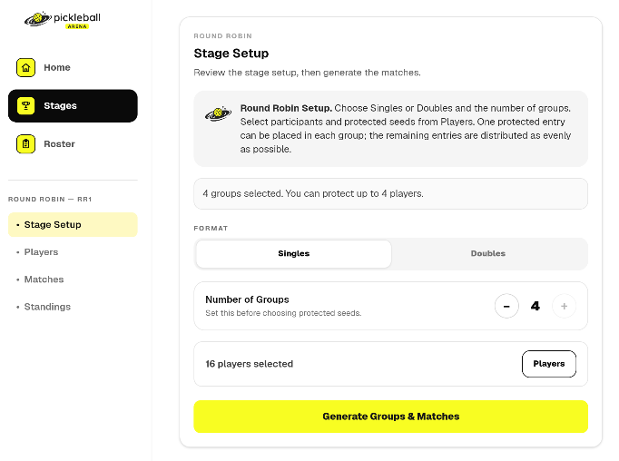
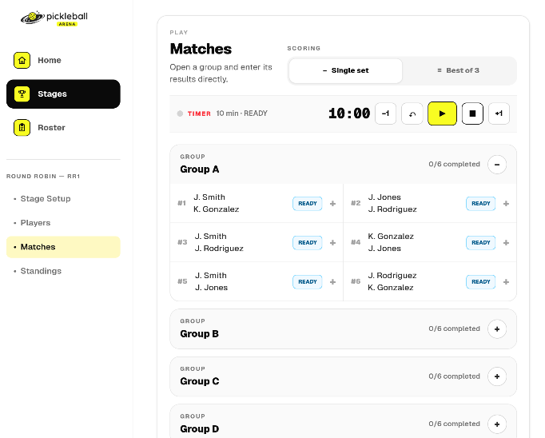
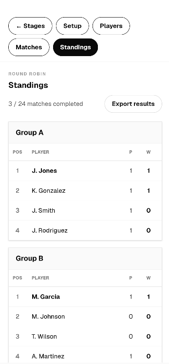

# Pickleball Arena Tournament Manager

## Round Robin

**Product:** Pickleball Arena Tournament Manager\
**App:** Pickleball Arena Tournament\
**Guide:** Round Robin\
**Language:** English

------------------------------------------------------------------------

## 1. What Round Robin Is

**Round Robin** is a competition format in which participants play
within one or more groups and the results produce group standings.

Depending on the tournament, entries can be individual players or teams.

Pickleball Arena Tournament Manager generates the required group
matches, allows results to be entered courtside, and updates the
standings as play progresses.

------------------------------------------------------------------------

## 2. When to Use Round Robin

Round Robin is useful when the organizer wants participants to play
several matches rather than being eliminated after a single loss.

It is particularly suitable for:

-   group-based competitions;
-   qualification phases;
-   events where standings are more important than immediate
    elimination;
-   competitions that may later continue into another stage.

The number of matches depends on the number of entries assigned to each
group.

------------------------------------------------------------------------

## 3. Number of Matches

For a group containing `n` entries, a complete single Round Robin
requires:

**n × (n - 1) / 2 matches**

For example:

-   4 entries require 6 matches;
-   5 entries require 10 matches;
-   6 entries require 15 matches;
-   8 entries require 28 matches.

This calculation is useful when deciding group sizes and estimating the
court time required for the stage.

If several groups are used, calculate the matches for each group and add
them together.

------------------------------------------------------------------------

## 4. Create the Stage

Create a new stage and select **Round Robin**.

Assign the required players or teams from the tournament roster.

Before generating the stage, verify that:

-   all intended participants are present;
-   the correct entries have been assigned;
-   teams are correctly composed when playing doubles with fixed teams;
-   the number of participants is appropriate for the intended group
    structure.

------------------------------------------------------------------------

## 5. Configure the Groups

*Round Robin stage configuration.*

Open **Setup** and configure the Round Robin structure.

The available options depend on the competition configuration and may
include the number of groups and stage-specific generation settings.

The application uses the configured structure to distribute the entries
and create the required matches.

Review the setup carefully before generation, because structural changes
after matches have been generated may require rebuilding the stage.

------------------------------------------------------------------------

## 6. Generate the Round Robin

Select **Generate** when the setup is complete.

The application creates the groups and the matches required by the
configured Round Robin structure.

After generation, review the groups before starting play.

Check that:

-   the expected participants are present;
-   the group distribution is correct;
-   the expected matches have been created.

The generated structure becomes the operational basis for the stage.

------------------------------------------------------------------------

## 7. Manage Matches

*Managing Round Robin matches on a tablet.*

Open **Matches** to run the Round Robin stage.

Each match identifies the two competing entries and its current state.

Enter the score when a match has been completed.

Depending on the configured competition format, match scoring can use
formats such as **Single Set** or **Best of 3**.

Recorded results are used to update the group standings.

------------------------------------------------------------------------

## 8. Courtside Result Entry

Results can be entered as matches are completed, allowing the organizer
to manage the competition directly from a smartphone or tablet.

Before saving a result, check:

-   that the correct match is selected;
-   that the score has been entered for the correct sides;
-   that the match is genuinely complete.

If a result needs correction, use the result-management functions
available in the match interface rather than creating a duplicate match.

------------------------------------------------------------------------

## 9. Standings

*Group standings on a smartphone.*

Open **Standings** to follow the current ranking within each group.

Standings are calculated from the results recorded for the Round Robin
matches.

As additional matches are completed, the table is updated to reflect the
current state of the competition.

The exact ranking information displayed depends on the configured
competition rules and scoring model.

The standings should therefore be considered provisional until all
required group matches have been completed.

------------------------------------------------------------------------

## 10. Understanding the Group Structure

A Round Robin group is independent from the other groups during its
match phase.

For example, with 12 entries divided into two groups of 6:

**Group A:** 6 entries → 15 matches\
**Group B:** 6 entries → 15 matches

Total:

**15 + 15 = 30 matches**

By comparison, putting all 12 entries into one complete Round Robin
group would require:

**12 × 11 / 2 = 66 matches**

Dividing a large field into groups can therefore reduce the number of
matches substantially while still giving every participant multiple
matches.

------------------------------------------------------------------------

## 11. Court Capacity and Playing Time

The number of courts affects how quickly a Round Robin stage can be
completed, but it does not change the number of matches required by a
complete group.

For example, a 6-entry group contains 15 matches.

With one court, those matches must be played sequentially.

With three available courts, several matches can be played
simultaneously, reducing the overall elapsed time.

When planning the stage, consider both:

**Total matches** --- determined by the group sizes.

**Concurrent matches** --- limited by the number of available courts and
participants.

------------------------------------------------------------------------

## 12. Round Robin as Part of a Larger Competition

A Round Robin stage can be used as a competition phase before another
stage.

For example, an organizer may run group play first and then continue
with an Elimination stage for qualified participants.

The exact progression between stages depends on the competition
configuration.

When using multiple stages, complete and verify the relevant standings
before using their results to determine progression into the next phase.

------------------------------------------------------------------------

## 13. Smartphone and Tablet Use

On a smartphone, the Round Robin workflow is optimized for quick
navigation between Setup, Matches, and Standings.

This is useful for entering results directly beside the courts.

On a tablet, the additional screen space makes group structures, match
lists, and standings easier to review at a glance.

The underlying competition data and workflow remain the same across
layouts.

------------------------------------------------------------------------

## 14. Practical Example

Consider 8 teams divided into two groups of 4.

Each group requires:

**4 × 3 / 2 = 6 matches**

With two groups:

**6 + 6 = 12 matches**

Each team plays 3 group matches.

If two courts are available, matches from the groups can be scheduled
across the available court capacity according to the organizer's playing
plan.

As results are entered, the standings show the developing ranking within
Group A and Group B.

At the end of group play, the final standings provide the outcome of the
Round Robin stage and can be used according to the competition's
next-step rules.

------------------------------------------------------------------------

## 15. Recommended Courtside Workflow

For a Round Robin stage:

1.  Create or open the tournament.
2.  Add players or teams to the Roster.
3.  Create a Round Robin stage.
4.  Assign the required entries.
5.  Configure the group structure and available stage options.
6.  Review the setup.
7.  Generate the groups and matches.
8.  Check the generated structure before starting.
9.  Open Matches and enter results as play progresses.
10. Use Standings to follow each group.
11. Verify all required results before considering the group standings
    final.
12. Continue to any subsequent competition stage when applicable.

------------------------------------------------------------------------

## 16. Key Principle

Round Robin is designed to give participants multiple matches and
produce a ranking based on group play.

The organizer defines the participants and group structure; Pickleball
Arena Tournament Manager generates the matches and keeps the competition
state and standings aligned with the recorded results.

For larger competitions, using multiple groups can provide a practical
balance between the number of matches, available courts, playing time,
and the opportunity for each participant to compete several times.
