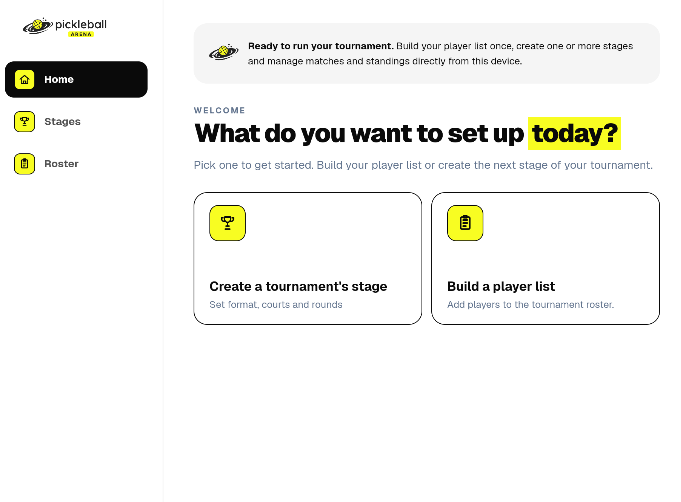
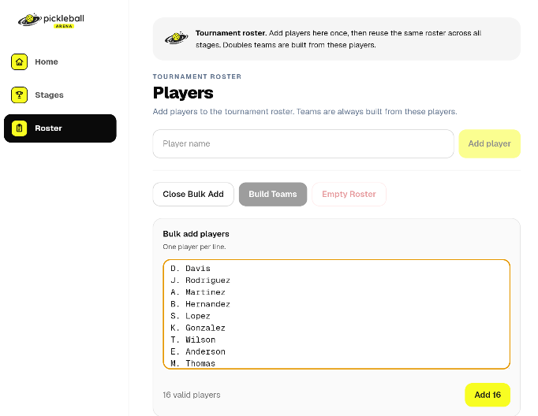

# Pickleball Arena Tournament Manager

## Tournament Management

**Product:** Pickleball Arena Tournament Manager\
**App:** Pickleball Arena Tournament\
**Guide:** Tournament Management\
**Language:** English

------------------------------------------------------------------------

## 1. Purpose

Tournament Management covers the common operations used to create and
organize a competition before and around its individual stages.

The general structure is:

**Tournament → Roster → Stage → Setup → Generate → Play → Results**

A tournament provides the container for its participants and competition
stages.

------------------------------------------------------------------------

## 2. Create a Tournament

*Tournament management on a tablet.*

From the Home screen, create a new tournament.

Enter the basic information required by the application and give the
tournament a clear, recognizable name.

After creation, open the tournament workspace to manage its roster and
stages.

------------------------------------------------------------------------

## 3. Tournament Workspace

The tournament workspace is the main working area for a competition.

From here the organizer can access the tournament's main sections,
including:

-   stages;
-   roster;
-   stage configuration;
-   generated competition structures;
-   matches;
-   standings or brackets, depending on the stage type.

Navigation adapts to the selected stage and to the available screen
size.

------------------------------------------------------------------------

## 4. Roster

*Roster management using the wider tablet layout.*

The **Roster** contains the participants available to the tournament.

Add the required players before configuring the competition stages.

Depending on the competition format, participants may later compete as
individual entries or as members of teams.

Before proceeding, verify that player names and team composition are
correct.

Keeping the roster accurate before generation reduces the need for
structural corrections after play has started.

------------------------------------------------------------------------

## 5. Stages

A tournament can contain one or more stages.

A stage defines a specific competition format and its generated match
structure.

The supported main formats are:

### Individual Rotation

Doubles matches with rotating combinations and an individual ranking.

### Round Robin

Group-based competition with generated matches and standings.

### Elimination

Knockout bracket with optional seeding and automatic winner progression.

Using stages allows a tournament to represent a simple single-format
event or a competition with multiple phases.

------------------------------------------------------------------------

## 6. Stage Participants

Participants required for a stage are selected from the tournament
roster.

The roster and stage entries therefore have different purposes:

**Roster** --- participants available to the tournament.

**Stage entries** --- participants actually assigned to a particular
stage.

Before generating a stage, check that the correct participants have been
assigned.

------------------------------------------------------------------------

## 7. Setup

Each stage has a **Setup** area containing the options relevant to its
competition format.

Depending on the stage, these can include:

-   courts;
-   rounds;
-   match duration;
-   match format;
-   groups;
-   seeds;
-   generation options.

The setup should be reviewed before generation because some structural
choices become significant once matches have been created.

------------------------------------------------------------------------

## 8. Generation

After configuration, use **Generate** to create the operational
structure for the stage.

Generation produces different results depending on the engine:

-   Individual Rotation → rotation and matches;
-   Round Robin → groups and matches;
-   Elimination → bracket and matches.

Always review the generated structure before starting competition play.

------------------------------------------------------------------------

## 9. Playing the Tournament

After generation, use the stage's match-management interface to run the
competition.

The organizer can enter results and follow the competition state as
matches are completed.

The corresponding standings or bracket are updated according to the
stage rules.

For detailed operational instructions, see **Match Management**.

------------------------------------------------------------------------

## 10. Multiple Stages

A tournament may use more than one stage when the competition requires
multiple phases.

For example:

**Round Robin → Elimination**

A first stage can establish standings or qualification results, while a
later stage can provide the knockout phase.

Before progressing to a later stage, verify that the results of the
previous stage are complete and that the correct participants have been
assigned to the next stage.

------------------------------------------------------------------------

## 11. Individual Rotation Sessions

Individual Rotation can operate as an extendable playing session.

After the initial rotation has been generated and played, the organizer
can add further rounds when additional time is available.

The existing schedule and completed results are preserved.

This differs from formats where the complete structural path is
determined when the stage is generated.

------------------------------------------------------------------------

## 12. Managing Structural Changes

Structural changes should be made before matches are played whenever
possible.

Changing participants, groups, seeds, or other generation parameters
after the competition structure exists can affect already generated
matches.

For this reason, review the setup and participant list before generation
and review the generated structure before recording the first result.

Once play is underway, prefer operational changes that preserve the
existing competition structure.

------------------------------------------------------------------------

## 13. Results and Competition State

Recorded match results are not isolated data.

They can affect:

-   Individual Rotation standings;
-   Round Robin standings;
-   Elimination winner progression;
-   later matches within a bracket.

Corrections should therefore be made carefully, particularly when later
matches already depend on an earlier result.

The application protects competition consistency where downstream
completed results would otherwise be invalidated.

------------------------------------------------------------------------

## 14. Smartphone Workflow

The smartphone layout is intended for courtside use.

Primary navigation keeps the main tournament and stage functions
accessible while limiting the amount of information shown
simultaneously.

Typical smartphone use includes:

-   opening the tournament;
-   checking the roster;
-   moving between stage sections;
-   entering results;
-   checking standings or bracket progression.

------------------------------------------------------------------------

## 15. Tablet Workflow

The tablet layout uses the additional screen space to provide a broader
competition overview.

It is particularly useful for:

-   larger match lists;
-   Individual Rotation schedules;
-   group standings;
-   Elimination brackets.

The underlying tournament data and operational rules remain the same as
on the smartphone interface.

------------------------------------------------------------------------

## 16. Recommended Tournament Workflow

For a typical competition:

1.  Create the tournament.
2.  Build and verify the Roster.
3.  Create the required stage.
4.  Assign the stage participants.
5.  Configure the stage in Setup.
6.  Review all structural settings.
7.  Generate the competition structure.
8.  Check the generated matches, groups, rotation, or bracket.
9.  Start play.
10. Enter results as matches are completed.
11. Follow Standings or Bracket.
12. Add further Individual Rotation rounds when required.
13. Complete any subsequent stages in the planned competition sequence.
14. Review the final competition results.

------------------------------------------------------------------------

## 17. Key Principle

Tournament Management separates the stable tournament information from
the competition logic of each stage.

The **Tournament** contains the event and its roster.

The **Stage** defines how a particular part of the competition is
played.

The **Stage Engine** generates and manages the corresponding rotation,
groups, or elimination bracket.

This structure allows Pickleball Arena Tournament Manager to support
different competition formats while maintaining a consistent workflow
for the organizer.
